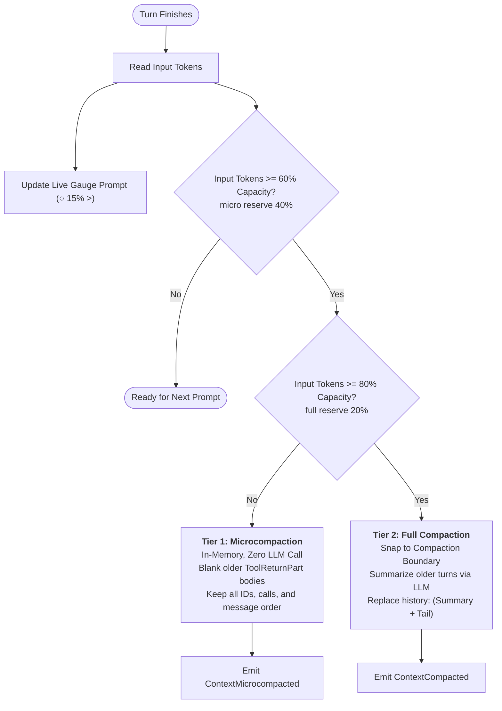
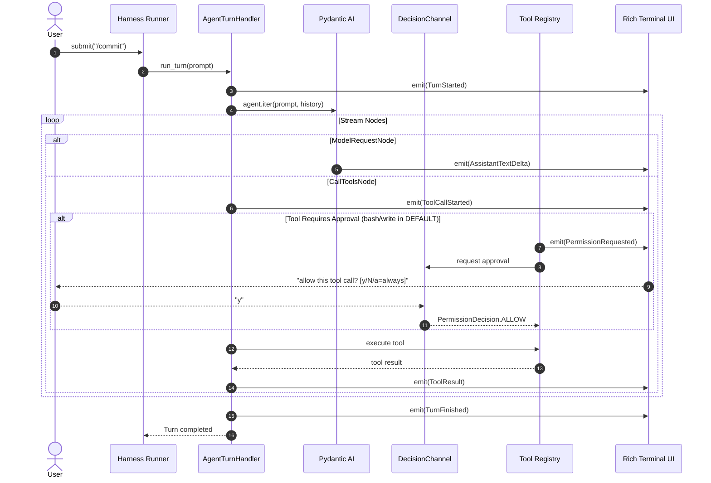

# Proto Harness

<h3 align="center">A Lightweight, From-Scratch Coding Agent Harness</h3>

<p align="center">
  <i>"The harness, not the model, makes a coding agent good."</i>
</p>

<p align="center">
  
</p>

---

## 📖 Overview

**Proto Harness** is a modular, event-driven coding agent harness built from first principles in Python.

Most AI agents only require ~20 lines of LLM integration code. Everything that makes an agent robust, interactive, safe, and pleasant to use in a real workspace is the **harness**:
- The turn lifecycle and state management
- Real-time token streaming and structured event propagation
- Concurrency and message queuing (steering & follow-up queues)
- **Human-in-the-loop (HITL) safety & permission gating** (`DEFAULT`, `PLAN`, `EDIT`, `BYPASS`)
- **Agent Skills Standard & Progressive Disclosure** (packaged built-ins + repo-local skills)
- **Persistent Workspace Memory** (`AGENTS.md` ancestor hierarchy + auto-updating `.proto_harness/MEMORY.md`)
- **Context Window Gauge & Auto-Compaction** (live token occupancy meter, in-memory microcompaction, and boundary-safe LLM summarization)
- Tool execution sandbox with precise file operations, workspace navigation, and shell safety
- Rich terminal user interface with unblocked interactive prompts and native Windows VT processing

---

## ⚙️ Architecture & Core Components

```
Proto_Harness/
├── src/proto_harness/
│   ├── cli.py                  # CLI entry point (`proto` command with -C, -p, -m, -M flags)
│   ├── frontmatter.py          # Shared YAML frontmatter parser for markdown documents
│   ├── logging.py              # File-based logging to .proto_harness/logs/
│   ├── config/
│   │   └── settings.py         # Pydantic BaseSettings (Gemini, OpenRouter, skills_dir, memory, compaction)
│   ├── context/
│   │   └── compaction.py       # Two-tier compaction cascade, boundary snapping, and token estimation
│   ├── entities/
│   │   ├── events.py           # Domain Event dataclasses (TurnStarted, ContextCompacted, ToolResult, etc.)
│   │   ├── permissions.py      # PermissionRequest, PermissionDecision, PermissionOutcome
│   │   └── skill_def.py        # Immutable SkillDef entity
│   ├── permissions/
│   │   ├── types.py            # PermissionMode and ToolKind enums
│   │   └── gate.py             # PermissionGate policy engine (mode × kind evaluation)
│   ├── memory/
│   │   ├── files.py            # Discovers root-to-cwd AGENTS.md and .proto_harness/MEMORY.md
│   │   ├── service.py          # Assembles memory context with headers and line budget capping
│   │   └── extract.py          # Automatic session summarization appended to MEMORY.md on exit
│   ├── skills/
│   │   ├── loader.py           # Discovers built-in and project-local skills
│   │   ├── catalog.py          # Assembles the prompt catalog menu block
│   │   ├── payload.py          # Formats instructions, bundled assets, and outputs trailer
│   │   └── builtin/            # Packaged default skills
│   │       ├── commit/SKILL.md
│   │       └── code-review/SKILL.md
│   ├── agent/
│   │   ├── deps.py             # Agent dependencies (cwd, emit, gate, resolve_permission)
│   │   ├── factory.py          # Model selection, agent factory, and dynamic memory/catalog hook
│   │   └── loop.py             # Headless turn handler (Pydantic AI stream)
│   ├── harness/
│   │   ├── decisions.py        # DecisionChannel for async mid-turn HITL approval
│   │   ├── queue.py            # Interaction queues (steering & follow-up)
│   │   └── runner.py           # Turn lifecycle state machine (Phase)
│   ├── tools/
│   │   ├── approval.py         # check_permission guard function
│   │   ├── bash.py             # Safe async subprocess runner (guarded)
│   │   ├── files.py            # read, write, edit, cd, pwd tools
│   │   ├── skills.py           # On-demand skill loader tool
│   │   └── registry.py         # Tool registration onto the Agent
│   └── tui/
│       ├── render.py           # Event-to-Rich renderers with append-style styling
│       └── app.py              # Async interactive REPL with patch_stdout and SlashCompleter
```

---

## 🧠 Skills System & Progressive Disclosure (`skills/`)

Rather than bloating system prompts with extensive instructions for every possible task, Proto Harness follows the **Agent Skills Standard** via **Progressive Disclosure**:

1. **Lightweight Menu (Turn-Level)**: Every turn, the system prompt only receives a clean, 1-line description for each available skill:
   ```markdown
   Skills you can load on demand — call skill("<name>") to read a skill's full instructions before following it:
   - code-review — Review recent changes or specific files for correctness, security, and cleanliness
   - commit — Inspect git status and diffs to create clean conventional commits
   ```
2. **On-Demand Loading**: When needed, the agent invokes `skill(name="...")` to load the full markdown instructions.
3. **Workspace Deliverables Standard**: Every loaded skill instructs the agent to store new standalone work-products under `.proto/outputs/` (unless another location is explicitly requested), keeping the workspace clean.

### Built-in Skills vs. Project Skills

- **Built-in Skills**: Bundled directly with Proto (`commit`, `code-review`).
- **Project Skills**: Create custom skills inside `<workspace>/.proto_harness/skills/<skill-name>/SKILL.md`. Project skills with matching names automatically override built-in skills!

---

## 💾 Persistent Workspace Memory (`memory/`)

Proto Harness equips the agent with persistent, multi-layered memory so it maintains project guidelines, repository architecture, and cross-session history without manual prompt engineering.

### 1. Dual-Layer Memory Hierarchy

Memory is loaded dynamically on every turn from two complementary sources:
- **`AGENTS.md` (Human-Curated Rules)**: Workspace instructions, architecture maps, and coding conventions written by developers.
- **`MEMORY.md` (Agent Session Knowledge)**: Machine-updated diary of past sessions, key architectural decisions, and learnings stored under `<workspace>/.proto_harness/MEMORY.md`.

### 2. Hierarchical Ancestor Discovery (`memory/files.py`)

Proto Harness traverses from the filesystem root down to the active working directory:
$$\text{Root} \longrightarrow \dots \longrightarrow \text{Parent} \longrightarrow \text{Current Working Directory}$$

1. Any `AGENTS.md` found along the ancestry is loaded in order (root first, current directory last). This enables monorepos or nested subprojects to inherit organization-wide guidelines while overriding or specializing rules for specific submodules.
2. The current workspace's `.proto_harness/MEMORY.md` is appended at the very end.

Every discovered block is formatted with explicit provenance headers so the model knows where each constraint originates:
```markdown
# From C:\Projects\AGENTS.md
[global organization standards...]

# From C:\Projects\MyRepo\AGENTS.md
[project-specific test instructions...]

# From C:\Projects\MyRepo\.proto_harness\MEMORY.md
- 2026-09-21: Configured database migration scripts and resolved circular imports.
```

### 3. Strict Budget Capping & Safety (`memory/service.py`)

To prevent memory files from exhausting LLM context windows as projects grow:
- Configured via `settings.memory_max_lines` (default: `200`) and `settings.memory_max_bytes` (default: `20,000`).
- `MEMORY.md` is automatically capped using `clip_lines_to_budget`, preserving whole lines from the head and cleanly noting truncation if the budget is exceeded.

### 4. Automatic Session Summarization on Exit (`memory/extract.py`)

When you end a session (`/quit` or `exit`), Proto Harness triggers a non-fatal exit extractor:
1. Gathers the session conversation turns.
2. Prompts the LLM for a concise 1-2 sentence summary of what was accomplished and any notable context for future runs.
3. Automatically appends a timestamped bullet point (`- YYYY-MM-DD: <summary>`) to `.proto_harness/MEMORY.md` in the current workspace directory.
4. **Resilient**: If network fails, the user cancels, or the LLM is unreachable, the exit summary fails silently and the REPL exits immediately without crashing.

### 5. Inspecting Memory Interactively (`/memory`)

At any point in the REPL, run `/memory` to view all discovered memory files along with the exact rendered text currently injected into the agent's context.

---

## 🔄 Context Compaction & Live Token Gauge (`context/`)

Long coding sessions inevitably accumulate thousands of tokens of file contents, tool outputs, and test logs. Proto Harness implements a proactive **two-tier compaction cascade** paired with a **real-time visual context gauge** to keep sessions running cleanly and indefinitely without context overflow errors.

### 1. The Real-Time Context Gauge (`○◔◑◕●`)

The pinned prompt continuously monitors provider-authoritative input tokens and displays a dynamic circular gauge with live token counts:
```text
○ 0% (884 tok) >
```

- **Visual Fill Glyphs**:
  - `○ 0% - 24%` (Empty - 🟢 Green)
  - `◔ 25% - 49%` (Quarter - 🟢 Green)
  - `◑ 50% - 74%` (Half - 🟡 Yellow)
  - `◕ 75% - 99%` (Three-quarters - 🔴 Red)
  - `● 100%` (Full - 🔴 Red)
- **Dynamic Prompt States**:
  - **Idle**: `○ 0% (2,450 tok) > `
  - **Agent Running**: `working… (or type to queue) > `
  - **Tool Approval Required**: `allow tool call? [y/N/a] > `

### 2. Two-Tier Compaction Cascade

Rather than waiting until the model's context window is 100% full, the harness acts proactively:



#### Tier 1: Microcompaction (Fast & Free)
- Fires at **60% capacity** (`microcompaction_reserve_fraction = 0.40`).
- In-memory only: replaces older bulky tool returns with `[tool output elided by microcompaction]`.
- Tool call IDs and structure are preserved 100% so tool call/return integrity is never broken.

#### Tier 2: Full Compaction (Structured LLM Summarization)
- Fires at **80% capacity** (`compaction_reserve_fraction = 0.20`).
- **Compaction Boundary Snapping**: Safely cuts history so that tool-call and tool-result pairs are never separated.
- Preserves the recent ~20,000 tokens verbatim so immediate work is not lost.
- Older turns are summarized into a concise markdown skeleton:
  ```markdown
  # Conversation summary
  ## Goal
  ## Constraints & Preferences
  ## Progress (Done / In Progress / Blocked)
  ## Key Decisions
  ## Next Steps
  ## Critical Context
  ```
- History is rewritten as `[summary_message, *recent_tail]`.

### 3. Manual Compaction (`/compact`)

At any point in the REPL, run `/compact` to manually trigger compaction and view token savings:
```text
○ 0% > /compact
Proto - compacting context...
Proto - compacted context (~35,000 tokens -> summary + 4 recent messages).
```

---

## 🛡️ Permissions & Human-in-the-Loop (HITL)

Proto Harness includes a full permission layer ensuring the agent cannot mutate files or execute arbitrary shell commands without your consent.

### 1. Permission Modes (`PermissionMode`)

| Mode | Mutating File Edits (`write`, `edit`) | Shell Commands (`bash`) | Read-Only & Skills (`read`, `pwd`, `skill`) | Typical Use Case |
|---|---|---|---|---|
| **`DEFAULT`** | 🟡 Ask user (`[y/N/a]`) | 🟡 Ask user (`[y/N/a]`) | 🟢 Auto-allow | Standard safe interactive pairing |
| **`PLAN`** | 🔴 Denied (read-only) | 🔴 Denied (read-only) | 🟢 Auto-allow | Exploration, planning, code review |
| **`EDIT`** | 🟢 Auto-allow | 🟡 Ask user (`[y/N/a]`) | 🟢 Auto-allow | Fast coding while keeping shell guarded |
| **`BYPASS`** | 🟢 Auto-allow | 🟢 Auto-allow | 🟢 Auto-allow | Automated scripts or fully trusted tasks |

### 2. The Decision Channel (`harness/decisions.py`)

When a tool requires confirmation:
1. The tool calls `check_permission()`.
2. The harness posts a `PermissionRequest` to the `DecisionChannel`.
3. The TUI surfaces an inline prompt: `allow this tool call? [y/N/a=always]`.
4. The user's response routes directly to the waiting tool:
   - `y` or `yes`: Approves the single call.
   - `a` or `always`: Approves the call and automatically switches the session to `BYPASS` mode.
   - `n` or Enter: Denies execution and returns a descriptive denial reason to the LLM.

---

## 🔄 The Agent Loop (`agent/loop.py`)

The core execution engine is encapsulated inside `AgentTurnHandler`. It drives iteration over LLM response nodes without binding to any specific UI.



---

## 🛠️ Tool System (`tools/`)

The agent has access to a structured toolset designed specifically for coding tasks:

| Tool | Permission Kind | Purpose | Key Features |
|---|---|---|---|
| `read(path, offset, limit)` | `READ_ONLY` | Inspect file contents | 1-indexed line ranges, windowed reading for large files |
| `write(path, content)` | `FILE_EDIT` | Create or overwrite files | Guarded by `PermissionGate`; creates parent dirs |
| `edit(path, old_text, new_text)` | `FILE_EDIT` | Precise code edits | Guarded by `PermissionGate`; requires exact block match |
| `bash(command)` | `OTHER` | Execute shell commands | Guarded by `PermissionGate`; async subprocess, configurable timeout |
| `cd(path)` | `READ_ONLY` | Change agent working directory | Relative or absolute paths; expands `~` |
| `pwd()` | `READ_ONLY` | Query active directory | Returns current working directory of agent |
| `find_files(pattern)` | `READ_ONLY` | Locate workspace files | Glob pattern matching |
| `grep(pattern, path)` | `READ_ONLY` | Search code patterns | Regex or substring search within workspace |
| `skill(name)` | `READ_ONLY` | Load skill instructions | Progressive disclosure; returns `ModelRetry` on unknown skills |
| `todo_write(tasks)` | `READ_ONLY` | Manage structured task checklist | Replace semantics; emits `TaskListUpdated` event with `[ ]`, `[~]`, `[x]` |
| `enter_plan_mode()` | `READ_ONLY` | Enter read-only planning mode | Programmatically switches session to `PLAN` mode |
| `exit_plan_mode(plan)` | `READ_ONLY` | Present plan and request approval | Asks human `[y/N]` via DecisionChannel; switches to `EDIT` on approval |

---

## 🎭 Agent Catalog & Personas (`agents/`)

Proto-Harness supports specialized agent personas defined in Markdown files with YAML frontmatter:

| Persona | Purpose | Default Mode | Key Tools |
|---|---|---|---|
| **`build`** (default) | Hands-on coding agent that reads, edits, runs commands, and tracks tasks | `DEFAULT` | Full toolset (`read`, `write`, `edit`, `bash`, `skill`, `todo_write`, `enter_plan_mode`) |
| **`plan`** | Safe read-only architect that explores codebase and drafts plans | `PLAN` | Safe tools + `todo_write` + `exit_plan_mode` |
| **`code-reviewer`** | Reviews code changes and git diffs for correctness and edge cases | `PLAN` | `read`, `bash` (`git`), `todo_write` |
| **`explore`** | Fast codebase reconnaissance without modifying files | `PLAN` | Read and navigation tools |

Switch personas mid-session anytime using `/agent <name>` — conversation history, memory, and task state are completely preserved!

---

## 🖥️ Terminal UI (`tui/`)

- **Pinned Input with `patch_stdout(raw=True)`**: Keeps the prompt pinned at the bottom while Rich logs, panels, and streaming markdown scroll smoothly above it.
- **Dynamic Context Gauge & Prompt States**: The prompt shows real-time context occupancy (`○ 0% (884 tok) > `), switches to `working… > ` while the model generates, and renders `allow tool call? [y/N/a] > ` during HITL approvals.
- **Clean Dialogue Styling**: Distinct background styling for user echo and assistant streaming with green/red bordered panels for tool executions.
- **Live Task Checklist Panel**: Redraws automatically whenever the model updates progress with `todo_write`.
- **Interactive Autocompletion (`SlashCompleter`)**: Press `/` in the prompt to trigger an instant autocomplete menu with descriptions for all commands, skills, and agent personas (`/agent <name>`).

### Interactive REPL Commands

| Command | Action |
|---|---|
| `/agent [name]` | View active persona or switch to another (e.g. `/agent plan`, `/agent build`) |
| `/agents` | List all available agent personas, their modes, descriptions, and allowed tools |
| `/<skill-name> [prompt]` | Run a skill directly (e.g. `/commit`, `/code-review`) |
| `/tasks` or `/todo` | Inspect the current in-memory task checklist (`[ ]`, `[~]`, `[x]`) |
| `/mode [name]` | Check the current mode, or switch to `default`, `plan`, `edit`, or `bypass` |
| `/compact` | Manually run full LLM compaction on older conversation history |
| `/memory` | Inspect the active assembled memory (`AGENTS.md` + `MEMORY.md`) injected into system prompt |
| `/cd <path>` or `cd <path>` | Change active working directory directly in the REPL |
| `/pwd` or `pwd` | Display the current working directory |
| `/clear` or `clear` / `cls` | Clear the terminal, reset conversation history, and re-zero the token gauge |
| `/quit` or `exit` | Exit the assistant (triggers automatic session summarization to `MEMORY.md`) |

---

## 🚀 Getting Started

### 1. Installation

Install in editable mode inside your virtual environment:

```powershell
cd Proto_Harness
.\penv\Scripts\python.exe -m pip install -e .
```

### 2. Configure Environment Variables

Create or edit `.env` in `Proto_Harness/`:

```env
LLM_PROVIDER=gemini
GEMINI_API_KEY="your-gemini-api-key"
OPENROUTER_API_KEY="your-openrouter-api-key"
```

### 3. CLI Usage & Flags

```powershell
# Default launch
proto

# Start directly in plan mode (read-only safe mode)
proto -M plan
# or
proto --mode plan

# Start in bypass mode (all permissions auto-approved)
proto -M bypass

# Specify custom workspace directory
proto -C "C:\path\to\your\project"

# Override provider and model
proto -p openrouter -m "anthropic/claude-3.5-sonnet"
```

---

## 💡 Key Design Takeaways

1. **Decoupled Architecture**: The agent core (`loop.py`), harness (`runner.py`), permission gate (`gate.py`), and skills catalog (`catalog.py`) communicate strictly via domain contracts.
2. **Progressive Disclosure**: Keeps token usage minimal while providing domain-specific workflows on demand.
3. **Single Input Surface for Turn, HITL, & Skills**: Approval questions and slash commands ride the live input surface without opening secondary prompt sessions or causing deadlocks.


