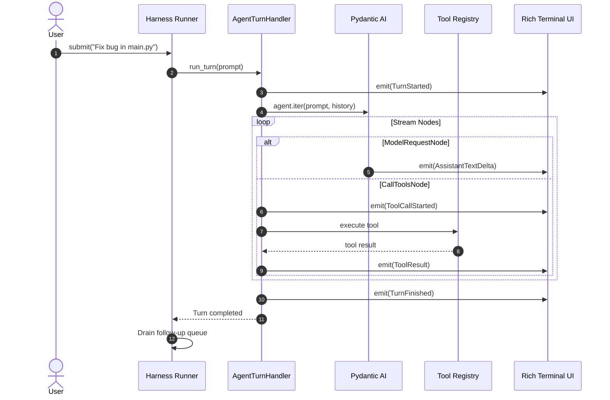

# Proto Harness


<h3 align="center">A Lightweight, From-Scratch Coding Agent Harness</h3>

<p align="center">
  <i>"The harness, not the model, makes a coding agent good."</i>
</p>

<p align="center">
  
</p>

---

## 📖 Overview

**Proto Harness** is a modular, event-driven coding agent harness built from first principles in Python.

Most AI agents only require ~20 lines of LLM integration code. Everything that makes an agent robust, interactive, safe, and pleasant to use in a real workspace is the **harness**:
- The turn lifecycle and state management
- Real-time token streaming and structured event propagation
- Concurrency and message queuing (steering & follow-up queues)
- Tool execution sandbox with precise file operations and shell safety
- Rich terminal user interface with unblocked interactive prompts

---

## ⚙️ Architecture & Core Components

```
Proto_Harness/
├── src/proto_harness/
│   ├── cli.py                  # CLI entry point (`proto` command)
│   ├── logging.py              # File-based logging to .proto_harness/logs/
│   ├── config/
│   │   └── settings.py         # Pydantic BaseSettings (Gemini, OpenRouter)
│   ├── entities/
│   │   └── events.py           # Domain Event dataclasses
│   ├── agent/
│   │   ├── deps.py             # Agent dependencies (cwd, emit function)
│   │   ├── factory.py          # Model selection and agent factory
│   │   └── loop.py             # Headless turn handler (Pydantic AI stream)
│   ├── harness/
│   │   ├── queue.py            # Interaction queues (steering & follow-up)
│   │   └── runner.py           # Turn lifecycle state machine (Phase)
│   ├── tools/
│   │   ├── bash.py             # Safe async subprocess runner
│   │   ├── files.py            # read, write, edit tools
│   │   └── registry.py         # Tool registration onto the Agent
│   └── tui/
│       ├── render.py           # Event-to-Rich renderers
│       └── app.py              # Async interactive REPL (prompt-toolkit)
```


---

## 🔄 The Agent Loop (`agent/loop.py`)

The core execution engine is encapsulated inside `AgentTurnHandler`. It drives the low-level iteration over LLM response nodes without binding to any specific UI.

### Step-by-Step Loop Lifecycle



### 1. Node Iteration
When a turn starts, the handler calls `agent.iter(prompt, message_history=self._history)`. Pydantic AI streams discrete execution nodes:
- **`ModelRequestNode`**: The LLM generates text or proposes tool calls. As tokens arrive, `AssistantTextDelta` events are emitted and rendered in real time.
- **`CallToolsNode`**: When the model requests tool execution, the handler intercepts each call, fires a `ToolCallStarted` event, runs the tool asynchronously, and emits a `ToolResult` event.
- **`EndNode`**: Represents the final completion of the agent turn.

### 2. Message History Retention
After completing a turn, the handler extracts the updated conversation messages via `run.result.all_messages()` and appends them to `self._history`. This preserves multi-turn context throughout the entire session.

### 3. Error Resilience
If an exception occurs mid-stream (e.g. API timeouts, rate limits, invalid tool arguments), the loop catches the error, emits an `AgentError` event, and allows the harness to recover gracefully without crashing the REPL.

---

## 🚦 Harness Functionality (`harness/`)

The harness sits between the agent loop and the user interface. It ensures deterministic execution, queue management, and lifecycle safety.

### 1. The Runner State Machine (`harness/runner.py`)

The `Runner` implements a single-flight execution model:

```
[ IDLE ] ──( submit prompt )──> [ DISPATCHING ] ──( start task )──> [ RUNNING ]
   ▲                                                                     │
   └──────────────────────( turn completed )─────────────────────────────┘
```

- **`IDLE`**: Ready to accept new user prompts.
- **`DISPATCHING`**: A prompt has been received; the async task is being scheduled. Setting the phase synchronously before the first `await` prevents race conditions.
- **`RUNNING`**: The agent is actively executing LLM queries or running tools.
- **`is_busy`**: Exposes whether the harness is actively processing a turn.

### 2. Interaction Queues (`harness/queue.py`)

Users can continue typing even while the agent is running tools or generating responses. Two queues manage concurrent input:

- **`steering` Queue**: Holds high-priority interjections meant to guide the current turn before the next LLM call.
- **`follow_up` Queue**: Stores prompts submitted while the runner is `RUNNING`. Once the current turn finishes (`TurnFinished`), the runner automatically drains this queue and starts the next turn.

---

## 🛠️ Tool System (`tools/`)

The agent has access to a structured toolset designed specifically for coding tasks:

| Tool | Purpose | Key Features |
|---|---|---|
| `read(path, offset, limit)` | Inspect file contents | 1-indexed line ranges, windowed reading for large files |
| `write(path, content)` | Create or overwrite files | Creates parent directories automatically |
| `edit(path, old_text, new_text)` | Precise code edits | Requires exact block matching; fails cleanly on ambiguities |
| `bash(command)` | Execute shell commands | Async subprocess, configurable timeout (`bash_timeout_s`), stdout/stderr truncation |

All tools receive `RunContext[AgentDeps]`, granting access to the working directory (`cwd`) and the event emitter (`emit`).

---

## 🖥️ Terminal UI & Event Rendering (`tui/`)

The user interface uses **`prompt-toolkit`** and **`Rich`**:

- **Pinned Input with `patch_stdout`**: `prompt_toolkit` ensures the input prompt `> ` remains cleanly pinned at the bottom of the terminal while Rich logs, tool panels, and markdown stream above it.
- **Event-Driven Renderer (`render.py`)**: Converts typed domain events (`ToolCallStarted`, `ToolResult`, `AssistantTextDelta`, `TurnFinished`, `AgentError`) into styled Rich `Panel`s and syntax-highlighted blocks.

---

## 🚀 Getting Started

### 1. Installation

Install in editable mode inside your virtual environment:

```powershell
cd Proto_Harness
.\penv\Scripts\python.exe -m pip install -e .
```

### 2. Configure Environment Variables

Create or edit `.env` in the root of `Proto_Harness/`:

```env
LLM_PROVIDER=gemini
GEMINI_API_KEY="your-gemini-api-key"
OPENROUTER_API_KEY="your-openrouter-api-key"
```

### 3. Run the Agent

Launch the interactive terminal session:

```powershell
proto
```

*(Or via module execution: `python -m proto_harness.cli`)*

---

## 💡 Key Design Takeaways

1. **Decoupled Architecture**: The agent core (`loop.py`), harness (`runner.py`), and UI (`app.py`, `render.py`) are strictly separated by an event contract (`events.py`).
2. **Single Source of Truth for State**: The `Runner` phase controls turn lifecycles, preventing overlapping LLM invocations.
3. **Robust Tool Safety**: File tools validate paths and target strings strictly to avoid silent code corruption.
