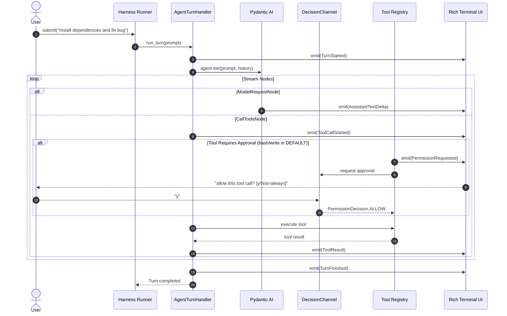

# Proto Harness

<h3 align="center">A Lightweight, From-Scratch Coding Agent Harness</h3>

<p align="center">
  <i>"The harness, not the model, makes a coding agent good."</i>
</p>

<p align="center">
  
</p>

---

## 📖 Overview

**Proto Harness** is a modular, event-driven coding agent harness built from first principles in Python.

Most AI agents only require ~20 lines of LLM integration code. Everything that makes an agent robust, interactive, safe, and pleasant to use in a real workspace is the **harness**:
- The turn lifecycle and state management
- Real-time token streaming and structured event propagation
- Concurrency and message queuing (steering & follow-up queues)
- **Human-in-the-loop (HITL) safety & permission gating** (`DEFAULT`, `PLAN`, `EDIT`, `BYPASS`)
- Tool execution sandbox with precise file operations, workspace navigation, and shell safety
- Rich terminal user interface with unblocked interactive prompts and native Windows VT processing

---

## ⚙️ Architecture & Core Components

```
Proto_Harness/
├── src/proto_harness/
│   ├── cli.py                  # CLI entry point (`proto` command with -C, -p, -m, -M flags)
│   ├── logging.py              # File-based logging to .proto_harness/logs/
│   ├── config/
│   │   └── settings.py         # Pydantic BaseSettings (Gemini, OpenRouter)
│   ├── entities/
│   │   ├── events.py           # Domain Event dataclasses (TurnStarted, ToolResult, etc.)
│   │   └── permissions.py      # PermissionRequest, PermissionDecision, PermissionOutcome
│   ├── permissions/
│   │   ├── types.py            # PermissionMode and ToolKind enums
│   │   └── gate.py             # PermissionGate policy engine (mode × kind evaluation)
│   ├── agent/
│   │   ├── deps.py             # Agent dependencies (cwd, emit, gate, resolve_permission)
│   │   ├── factory.py          # Model selection and agent factory
│   │   └── loop.py             # Headless turn handler (Pydantic AI stream)
│   ├── harness/
│   │   ├── decisions.py        # DecisionChannel for async mid-turn HITL approval
│   │   ├── queue.py            # Interaction queues (steering & follow-up)
│   │   └── runner.py           # Turn lifecycle state machine (Phase)
│   ├── tools/
│   │   ├── approval.py         # check_permission guard function
│   │   ├── bash.py             # Safe async subprocess runner (guarded)
│   │   ├── files.py            # read, write, edit, cd, pwd tools
│   │   └── registry.py         # Tool registration onto the Agent
│   └── tui/
│       ├── render.py           # Event-to-Rich renderers with append-style styling
│       └── app.py              # Async interactive REPL with patch_stdout(raw=True)
```

---

## 🛡️ Permissions & Human-in-the-Loop (HITL)

Proto Harness includes a full permission layer ensuring the agent cannot mutate files or execute arbitrary shell commands without your consent.

### 1. Permission Modes (`PermissionMode`)

| Mode | Mutating File Edits (`write`, `edit`) | Shell Commands (`bash`) | Read-Only Tools (`read`, `pwd`, `grep`) | Typical Use Case |
|---|---|---|---|---|
| **`DEFAULT`** | 🟡 Ask user (`[y/N/a]`) | 🟡 Ask user (`[y/N/a]`) | 🟢 Auto-allow | Standard safe interactive pairing |
| **`PLAN`** | 🔴 Denied (read-only) | 🔴 Denied (read-only) | 🟢 Auto-allow | Exploration, planning, code review |
| **`EDIT`** | 🟢 Auto-allow | 🟡 Ask user (`[y/N/a]`) | 🟢 Auto-allow | Fast coding while keeping shell guarded |
| **`BYPASS`** | 🟢 Auto-allow | 🟢 Auto-allow | 🟢 Auto-allow | Automated scripts or fully trusted tasks |

### 2. The Decision Channel (`harness/decisions.py`)

When a tool requires confirmation:
1. The tool calls `check_permission()`.
2. The harness posts a `PermissionRequest` to the `DecisionChannel`.
3. The TUI surfaces an inline prompt: `allow this tool call? [y/N/a=always]`.
4. The user's response routes directly to the waiting tool:
   - `y` or `yes`: Approves the single call.
   - `a` or `always`: Approves the call and automatically switches the session to `BYPASS` mode.
   - `n` or Enter: Denies execution and returns a descriptive denial reason to the LLM.

---

## 🔄 The Agent Loop (`agent/loop.py`)

The core execution engine is encapsulated inside `AgentTurnHandler`. It drives iteration over LLM response nodes without binding to any specific UI.



---

## 🛠️ Tool System (`tools/`)

The agent has access to a structured toolset designed specifically for coding tasks:

| Tool | Permission Kind | Purpose | Key Features |
|---|---|---|---|
| `read(path, offset, limit)` | `READ_ONLY` | Inspect file contents | 1-indexed line ranges, windowed reading for large files |
| `write(path, content)` | `FILE_EDIT` | Create or overwrite files | Guarded by `PermissionGate`; creates parent dirs |
| `edit(path, old_text, new_text)` | `FILE_EDIT` | Precise code edits | Guarded by `PermissionGate`; requires exact block match |
| `bash(command)` | `OTHER` | Execute shell commands | Guarded by `PermissionGate`; async subprocess, configurable timeout |
| `cd(path)` | `READ_ONLY` | Change agent working directory | Relative or absolute paths; expands `~` |
| `pwd()` | `READ_ONLY` | Query active directory | Returns current working directory of agent |
| `find_files(pattern)` | `READ_ONLY` | Locate workspace files | Glob pattern matching |
| `grep(pattern, path)` | `READ_ONLY` | Search code patterns | Regex or substring search within workspace |

---

## 🖥️ Terminal UI & Windows VT Support (`tui/`)

- **Pinned Input with `patch_stdout(raw=True)`**: Keeps the `> ` prompt pinned at the bottom while Rich logs, panels, and streaming markdown scroll smoothly above it.
- **Native Windows VT100 / ANSI Processing**: Automatically enables `ENABLE_VIRTUAL_TERMINAL_PROCESSING` (`0x0004`) on `STD_OUTPUT_HANDLE`, `STD_ERROR_HANDLE`, and `CONOUT$` via `ctypes` on Windows. Eliminates raw `?[...m` escape code artifacts in PowerShell and conhost.
- **Clean Dialogue Styling**: Distinct background styling for user echo and assistant streaming with green/red bordered panels for tool executions.
- **Pydantic AI Banner Suppression**: Automatically sets `PYDANTIC_AI_NO_BANNER=1` to ensure a clean, uncluttered startup.

### Interactive REPL Commands

During an active session, you can run instant control commands:

| Command | Action |
|---|---|
| `/mode [name]` | Check the current mode, or switch to `default`, `plan`, `edit`, or `bypass` |
| `/cd <path>` or `cd <path>` | Change active working directory directly in the REPL |
| `/pwd` or `pwd` | Display the current working directory |
| `/clear` or `clear` / `cls` | Clear the terminal and re-display the active configuration banner |
| `/quit` or `exit` | Exit the assistant |

---

## 🚀 Getting Started

### 1. Installation

Install in editable mode inside your virtual environment:

```powershell
cd Proto_Harness
.\penv\Scripts\python.exe -m pip install -e .
```

### 2. Configure Environment Variables

Create or edit `.env` in `Proto_Harness/`:

```env
LLM_PROVIDER=gemini
GEMINI_API_KEY="your-gemini-api-key"
OPENROUTER_API_KEY="your-openrouter-api-key"
```

### 3. CLI Usage & Flags

```powershell
# Default launch
proto

# Start directly in plan mode (read-only safe mode)
proto -M plan
# or
proto --mode plan

# Start in bypass mode (all permissions auto-approved)
proto -M bypass

# Specify custom workspace directory
proto -C "C:\path\to\your\project"

# Override provider and model
proto -p openrouter -m "anthropic/claude-3.5-sonnet"
```

---

## 💡 Key Design Takeaways

1. **Decoupled Architecture**: The agent core (`loop.py`), harness (`runner.py`), permission gate (`gate.py`), and UI (`app.py`, `render.py`) communicate strictly via domain contracts.
2. **Single Input Surface for Turn & HITL**: Approval questions consume the live input surface without opening secondary prompt sessions or causing deadlocks.
3. **Graceful Degradation & Portability**: Native terminal handling works seamlessly on Windows PowerShell, Command Prompt, and Unix terminals.
